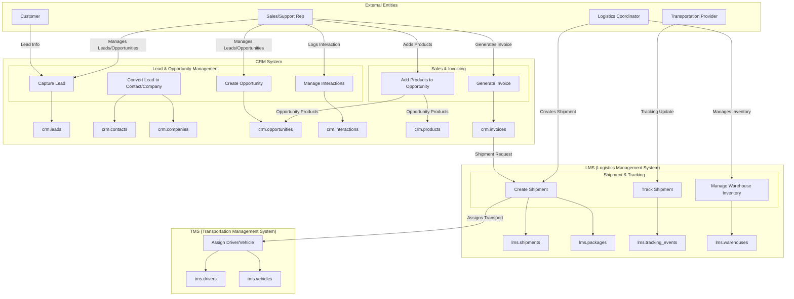
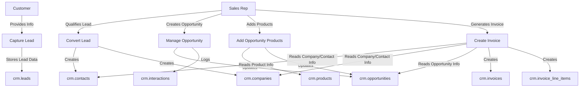
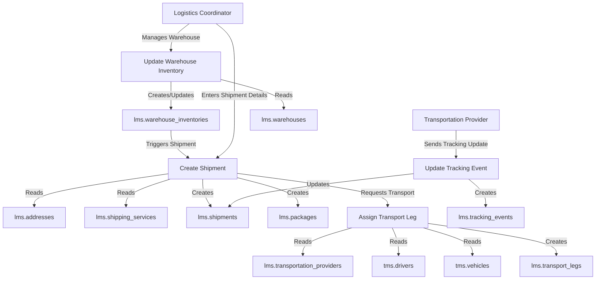
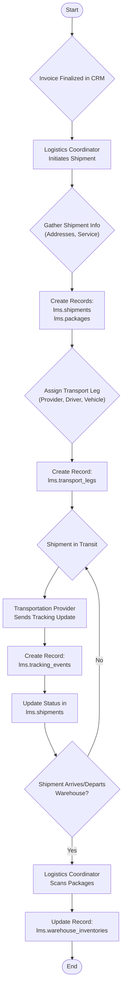

Detailed Process: Lead to Invoice This diagram shows the flow from capturing a
new lead to generating an invoice.

Detailed Process: Shipment Creation and Tracking This diagram details the
process of creating a shipment from an invoice and tracking its progress.

Process Flowchart: Shipment Creation and Tracking This flowchart shows the
sequential steps involved in the shipment process.

